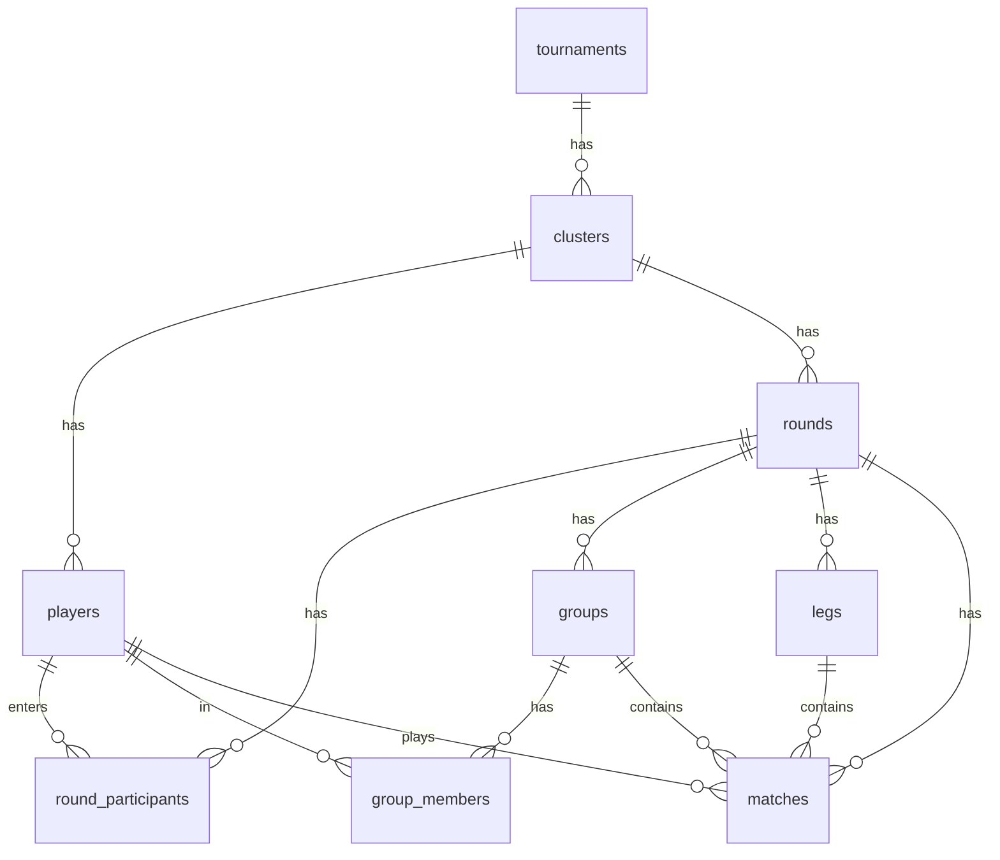

# Thiết kế Database — AoE Liên Tỉnh Director

> Nền tảng: **Next.js + Supabase (PostgreSQL)**. Mọi thao tác ghi đi qua Next.js
> Server Actions / Route Handlers dùng *service role key* (chỉ ở server). Trang
> public đọc qua *anon key* + RLS chỉ cho `SELECT` các dữ liệu thuộc phạm vi
> được phép. Bật **Supabase Realtime** cho các bảng phục vụ cổng public.

---

## 1. Tổng quan quan hệ

```
tournaments (giải đấu tổng)
  └── clusters (cụm thi đấu)
        ├── players (game thủ)
        └── rounds (vòng đấu)
              ├── round_participants (game thủ đầu vào + kết cục)
              ├── groups (bảng đấu)            ← chỉ round_type = group
              │     └── group_members
              ├── legs (lượt đấu)              ← số lượt suy ra từ cấu hình
              └── matches (cặp đấu)

format_templates (bộ thể thức tái sử dụng)   ← độc lập, dùng để khởi tạo rounds
app_settings (cấu hình hệ thống, key/value)
```



---

## 2. Enums

```sql
-- Trạng thái cụm: quyết định khả năng hiển thị ở cổng public
create type cluster_status as enum ('draft', 'ongoing', 'finished');
-- draft    : chưa thi đấu  → KHÔNG hiển thị cho public
-- ongoing  : đang thi đấu  → hiển thị
-- finished : đã thi đấu    → hiển thị

create type round_type as enum (
  'group',            -- chia bảng
  'swiss',            -- nhánh thắng thua (thắng gặp thắng, thua gặp thua)
  'knockout_multi',   -- loại trực tiếp chọn nhiều (1 lượt, winners đi tiếp)
  'knockout_single'   -- loại trực tiếp chọn 1 (bracket cố định → 1 vô địch)
);

create type round_status as enum ('pending', 'ongoing', 'finished');

create type participant_outcome as enum ('pending', 'advanced', 'eliminated');

create type match_status as enum ('scheduled', 'ongoing', 'done');
```

> `round_type` là tập **cố định do dev định nghĩa** (đúng yêu cầu: quy tắc vận
> hành phức tạp, chỉ dev thêm loại mới). Tham số của từng loại nằm trong cột
> `rounds.config` (JSONB) — xem mục 9.

---

## 3. `tournaments` — Giải đấu tổng

| Cột | Kiểu | Ràng buộc | Ghi chú |
|---|---|---|---|
| id | uuid | PK, default `gen_random_uuid()` | |
| name | text | NOT NULL | vd "AoE Liên Tỉnh 2026" |
| year | int | NOT NULL | |
| created_at | timestamptz | NOT NULL default `now()` | |

> Data giữa các giải tổng **độc lập** hoàn toàn.

---

## 4. `clusters` — Cụm thi đấu

| Cột | Kiểu | Ràng buộc | Ghi chú |
|---|---|---|---|
| id | uuid | PK | |
| tournament_id | uuid | FK → tournaments, NOT NULL, ON DELETE CASCADE | |
| name | text | NOT NULL | đặt theo nơi tổ chức: "Cụm Hà Nội"… |
| location | text | NULL | địa điểm / quán net |
| match_date | date | NULL | ngày thi đấu |
| status | cluster_status | NOT NULL default `'draft'` | điều khiển hiển thị public |
| created_at | timestamptz | NOT NULL default `now()` | |

Index: `(tournament_id)`, `(tournament_id, status)`.

---

## 5. `players` — Game thủ

Mỗi lần tham gia = 1 bản ghi thuộc 1 cụm. Cùng một người ở cụm/giải khác là bản
ghi mới, không liên kết.

| Cột | Kiểu | Ràng buộc | Ghi chú |
|---|---|---|---|
| id | uuid | PK | |
| cluster_id | uuid | FK → clusters, NOT NULL, ON DELETE CASCADE | |
| full_name | text | **NOT NULL** | bắt buộc |
| phone | text | **NOT NULL** | bắt buộc |
| aoe_nickname | text | NULL | |
| birth_date | date | NULL | |
| citizen_id | text | NULL | CCCD |
| address | text | NULL | |
| facebook_url | text | NULL | |
| created_at | timestamptz | NOT NULL default `now()` | |

> **Không** đặt unique cứng trên CCCD. Việc chống trùng CCCD được kiểm tra **động
> ở tầng ứng dụng** dựa trên `app_settings.check_duplicate_cccd` (mặc định tắt).
> Khi bật, kiểm tra trùng trong phạm vi cùng `cluster_id`.

Index: `(cluster_id)`.

---

## 6. `rounds` — Vòng đấu (thuộc 1 cụm)

| Cột | Kiểu | Ràng buộc | Ghi chú |
|---|---|---|---|
| id | uuid | PK | |
| cluster_id | uuid | FK → clusters, NOT NULL, ON DELETE CASCADE | |
| order_no | int | NOT NULL | thứ tự vòng 1, 2, 3… |
| name | text | NOT NULL | "Vòng quần chiến", "Vòng bảng"… |
| round_type | round_type | NOT NULL | |
| config | jsonb | NOT NULL default `'{}'` | tham số theo loại (mục 9) |
| status | round_status | NOT NULL default `'pending'` | |
| created_at | timestamptz | NOT NULL default `now()` | |

Ràng buộc: unique `(cluster_id, order_no)`.

---

## 7. `round_participants` — Game thủ đầu vào & kết cục của 1 vòng

Output của vòng N (`outcome = 'advanced'`) chính là input của vòng N+1. Nhờ bảng
này biết được ai còn thi đấu, ai đã bị loại và **bị loại ở vòng nào**.

| Cột | Kiểu | Ràng buộc | Ghi chú |
|---|---|---|---|
| id | uuid | PK | |
| round_id | uuid | FK → rounds, NOT NULL, ON DELETE CASCADE | |
| player_id | uuid | FK → players, NOT NULL | |
| outcome | participant_outcome | NOT NULL default `'pending'` | |
| wins | int | NOT NULL default 0 | cache cho swiss & xếp hạng |
| losses | int | NOT NULL default 0 | cache |
| created_at | timestamptz | NOT NULL default `now()` | |

Ràng buộc: unique `(round_id, player_id)`.

---

## 8. `groups` + `group_members` — Bảng đấu (chỉ `round_type = group`)

### `groups`
| Cột | Kiểu | Ràng buộc | Ghi chú |
|---|---|---|---|
| id | uuid | PK | |
| round_id | uuid | FK → rounds, NOT NULL, ON DELETE CASCADE | |
| name | text | NOT NULL | "Bảng A", "Bảng B"… |

### `group_members`
| Cột | Kiểu | Ràng buộc | Ghi chú |
|---|---|---|---|
| id | uuid | PK | |
| group_id | uuid | FK → groups, NOT NULL, ON DELETE CASCADE | |
| player_id | uuid | FK → players, NOT NULL | |
| wins | int | NOT NULL default 0 | cache số trận thắng |
| score_diff | int | NOT NULL default 0 | cache hiệu số thắng-thua |
| rank | int | NULL | hạng trong bảng (tính sau) |

> Xếp hạng bảng: số trận thắng → hiệu số → đối đầu (head-to-head). Tính từ
> `matches`; các cột `wins/score_diff/rank` là cache để hiển thị nhanh.
Ràng buộc: unique `(group_id, player_id)`.

---

## 9. `legs` — Lượt đấu bên trong 1 vòng

**Số lượt KHÔNG do admin nhập** — được suy ra từ cấu hình vòng. Admin chỉ chỉnh
số chạm / số lượt-thắng-để-đi-tiếp; UI hiển thị số lượt tương ứng.

| Cột | Kiểu | Ràng buộc | Ghi chú |
|---|---|---|---|
| id | uuid | PK | |
| round_id | uuid | FK → rounds, NOT NULL, ON DELETE CASCADE | |
| leg_no | int | NOT NULL | 1,2,3… hoặc tầng bracket |
| name | text | NOT NULL | "Lượt 1", "Tứ kết", "Chung kết"… |

Ràng buộc: unique `(round_id, leg_no)`.

### Quy tắc suy ra số lượt theo loại vòng

| round_type | config (do admin/dev đặt) | Số lượt (`legs`) | Diễn giải |
|---|---|---|---|
| **swiss** | `wins_to_advance` (slw), `best_of` (sc) | `2 * wins_to_advance − 1` | slw=2 → 3 lượt. Mỗi cặp trong 1 lượt đánh chạm `best_of`. |
| **group** | `groups_count`, `group_sizes[]`, `advance_per_group` (=2), `best_of` (=3) | 1 (vòng tròn) | Mỗi cặp trong bảng gặp nhau 1 lần, chạm `best_of`. |
| **knockout_multi** | `best_of` | 1 | Chia cặp 1 lượt, người thắng đi tiếp. |
| **knockout_single** | `best_of`, `final_best_of`, `third_place` (bool) | `log2(input)` tầng | Tứ kết → bán kết → chung kết; có trận tranh 3–4 nếu `third_place=true`. Input bắt buộc là lũy thừa của 2. |

Ví dụ `config` JSONB:
```jsonc
// swiss (vòng quần chiến): thắng 2 lượt đi tiếp, mỗi trận chạm 2
{ "wins_to_advance": 2, "best_of": 2 }      // ⇒ tối đa 3 lượt

// group (vòng bảng)
{ "groups_count": 4, "group_sizes": [4,4,4,4], "advance_per_group": 2, "best_of": 3 }

// knockout_single (loại trực tiếp tìm vô địch)
{ "best_of": 4, "final_best_of": 5, "third_place": true }
```

---

## 10. `matches` — Cặp đấu

Trong cùng 1 vòng, 1 game thủ có thể đánh nhiều lượt; **mỗi lượt ngồi 1 máy khác
nhau** → số máy lưu theo từng match.

| Cột | Kiểu | Ràng buộc | Ghi chú |
|---|---|---|---|
| id | uuid | PK | |
| round_id | uuid | FK → rounds, NOT NULL, ON DELETE CASCADE | |
| leg_id | uuid | FK → legs, NULL | lượt đấu |
| group_id | uuid | FK → groups, NULL | nếu là trận trong bảng |
| player1_id | uuid | FK → players, NULL | NULL khi chưa xác định |
| player2_id | uuid | FK → players, NULL | NULL khi bye / chưa xác định |
| player1_machine | text | NULL | số máy game thủ 1 |
| player2_machine | text | NULL | số máy game thủ 2 |
| player1_score | int | NOT NULL default 0 | tỉ số loạt |
| player2_score | int | NOT NULL default 0 | tỉ số loạt |
| winner_id | uuid | FK → players, NULL | |
| is_bye | bool | NOT NULL default false | thắng tự động (lẻ game thủ) |
| status | match_status | NOT NULL default `'scheduled'` | |
| next_match_id | uuid | FK → matches, NULL | KO: người thắng đi đâu |
| next_match_slot | int | NULL | vào slot 1 hay 2 của trận sau |
| loser_next_match_id | uuid | FK → matches, NULL | cho trận tranh 3–4 |
| created_at | timestamptz | NOT NULL default `now()` | |

Index: `(round_id)`, `(leg_id)`, `(group_id)`.

> - **Kết quả** chỉ lưu **tỉ số loạt** (vd 3–1) + `winner_id`; không lưu chi tiết
>   từng ván hay thứ tự ván.
> - **Bye**: 1 match có `player2_id = NULL`, `is_bye = true`, người còn lại tự
>   động thắng.
> - **Random ghép cặp**: admin có thể bấm random nhiều lần ở UI; chỉ **bản chốt
>   cuối** mới được ghi vào `matches`. Các lần thử là tạm thời, không lưu DB.
> - **Bracket loại trực tiếp** (`knockout_single`): dùng `next_match_id` +
>   `next_match_slot` để nối người thắng sang trận sau; `loser_next_match_id`
>   cho trận tranh 3–4. Nhờ vậy game thủ thấy được đường đi tới chung kết.

---

## 11. `format_templates` — Bộ thể thức tái sử dụng

Khuôn để khởi tạo nhanh các vòng cho 1 cụm; sau khi áp vào cụm thì admin vẫn
chỉnh tự do (số vòng, số chạm, số người/bảng…). "Sự thật" nằm ở `rounds` của
cụm, template chỉ là điểm xuất phát.

| Cột | Kiểu | Ràng buộc | Ghi chú |
|---|---|---|---|
| id | uuid | PK | |
| name | text | NOT NULL | "Thể thức A", "B", "C" |
| description | text | NULL | |
| spec | jsonb | NOT NULL | danh sách vòng (round_type + config) |
| created_at | timestamptz | NOT NULL default `now()` | |

Ví dụ `spec` (thể thức A: quần chiến → bảng → loại trực tiếp):
```jsonc
{
  "rounds": [
    { "order_no": 1, "name": "Vòng quần chiến", "round_type": "swiss",
      "config": { "wins_to_advance": 2, "best_of": 2 } },
    { "order_no": 2, "name": "Vòng bảng", "round_type": "group",
      "config": { "advance_per_group": 2, "best_of": 3 } },
    { "order_no": 3, "name": "Vòng loại trực tiếp", "round_type": "knockout_single",
      "config": { "best_of": 4, "final_best_of": 5, "third_place": true } }
  ]
}
```

---

## 12. `app_settings` — Cấu hình hệ thống (key/value)

| Cột | Kiểu | Ràng buộc |
|---|---|---|
| key | text | PK |
| value | jsonb | NOT NULL |
| updated_at | timestamptz | NOT NULL default `now()` |

Các key dùng trong trang **Settings** của admin:

| key | value (ví dụ) | Ý nghĩa |
|---|---|---|
| `check_duplicate_cccd` | `false` | Bật/tắt kiểm tra trùng CCCD khi nhập game thủ (mặc định **false**) |
| `current_tournament_id` | `"<uuid>"` | Giải tổng đang hiển thị ở cổng public |
| `current_cluster_id` | `"<uuid>"` | Cụm mở mặc định ở cổng public (nullable) |

> **Mật khẩu admin** KHÔNG nằm trong DB — lưu ở biến môi trường server
> (`ADMIN_PASSWORD`). Lần đầu trên mỗi thiết bị, người dùng nhập password; client
> gọi API server để xác thực, đúng thì lưu cờ vào `localStorage` → lần sau không
> hỏi lại.

---

## 13. Phạm vi hiển thị (Public) & RLS

Cổng public **chỉ** được xem:
- Các cụm thuộc **giải tổng hiện tại** (`current_tournament_id`),
- có `status IN ('ongoing', 'finished')`.

KHÔNG cho xem: giải tổng khác, hoặc cụm `draft` (chưa thi đấu).

Cách thực thi đề xuất:
- **Public reads** (anon key): RLS cho `SELECT` các bản ghi mà cụm gốc thỏa điều
  kiện trên (join về `clusters.status` và `current_tournament_id`).
- **Admin writes**: qua Next.js server bằng *service role key* (bỏ qua RLS),
  sau khi xác thực `ADMIN_PASSWORD`.
- **Realtime**: bật cho `clusters`, `rounds`, `groups`, `group_members`, `legs`,
  `matches`, `round_participants` để cổng public & livestream cập nhật tức thì.

---

## 14. Ghi chú triển khai
- Toàn bộ logic xếp cặp / chia bảng / tính bảng xếp hạng / sinh bracket chạy ở
  **server (TypeScript)**; DB chỉ lưu trạng thái.
- Không dùng backend framework khác ngoài Next.js (Server Actions / Route
  Handlers) + Supabase client.
